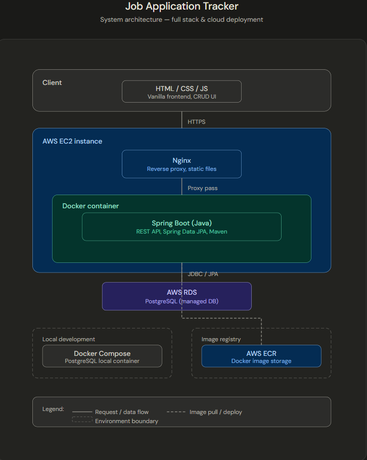
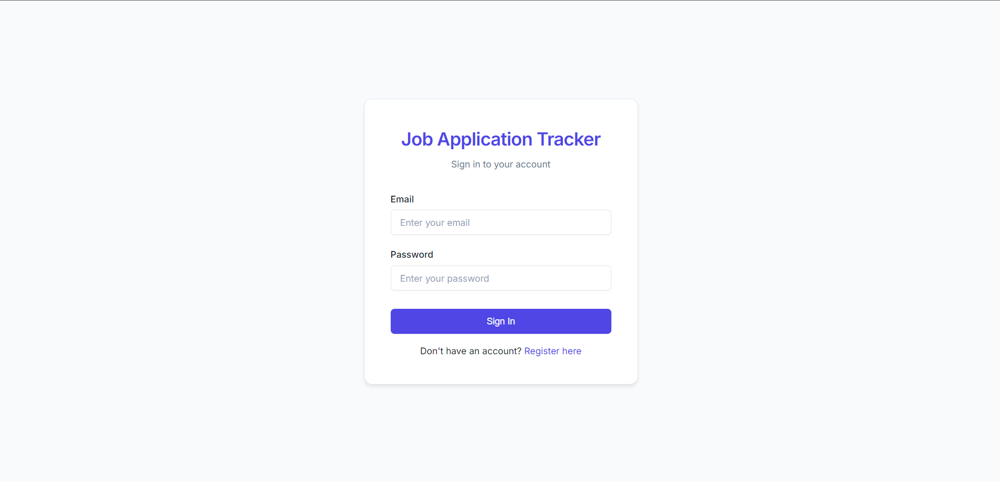
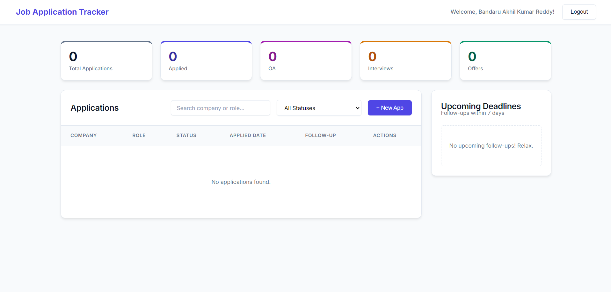
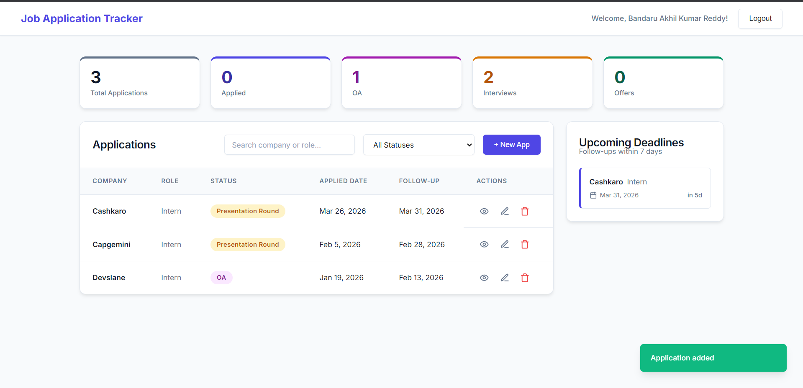
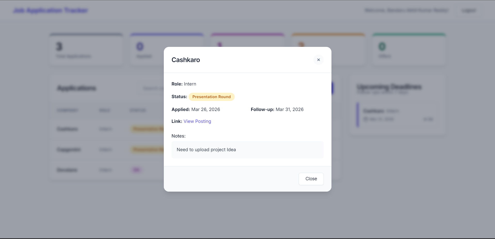

<h1 align="left">Job Application Tracker</h1>


###

<p align="left">The Job Application Tracker is a full-stack web application designed to help users efficiently manage and track their job applications in one place.<br><br>It enables users to add, update, filter, and monitor application progress while demonstrating real-world backend development, database management, and cloud deployment using modern DevOps practices.</p>
<p align="center">
  <a href="http://3.208.22.40/">
    
  </a>
</p>


<h2 align="left">## Features</h2>

###

<p align="left">- Add, update, and delete job applications<br>- Track application status (Applied, Interview, Offer, Rejected)<br>- Filter and manage applications efficiently<br>- RESTful API with proper validation<br>- Dockerized setup for easy deployment</p>

###

<h2 align="left">## Architecture</h2>

###

<div align="center">
  
</div>

###

<h2 align="left">## Tech Stack</h2>

###

<p align="left">- Backend: Java Spring Boot, Spring Data JPA<br>- Database: PostgreSQL (Docker locally, AWS RDS in prod)<br>- DevOps: Docker, GitHub Actions, EC2, Nginx</p>

###

<h2 align="left">## Prerequisites</h2>

###

<p align="left">- Java 17+<br>- Docker & Docker Compose</p>

###

<h2 align="left">## Getting Started</h2>

###

<p align="left">```bash<br>git clone https://github.com/your-username/your-repo.git<br>cd your-repo<br>cp .env.example .env   # fill in your values<br>docker-compose up -d<br>mvn spring-boot:run<br>```</p>

###

<h2 align="left">## Deployment</h2>

###

<p align="left">Deployed on AWS EC2 with Nginx as reverse proxy.</p>


<h2 align="left">## ScreenShots</h2>
<div align="center">
  
  
  
  
</div>


###
